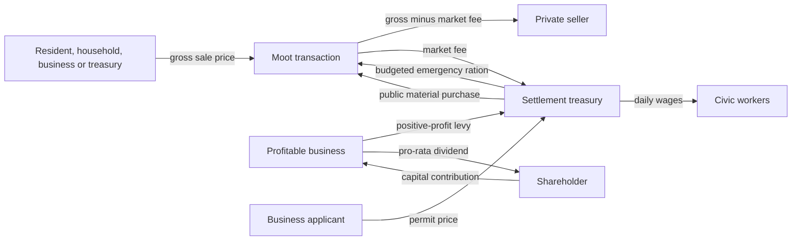

# Civic economy

This document is the authoritative guide to the settlement treasury, enacted policy,
public employment and their interaction with the private market. It describes the live
implementation, including the 2026-09-15 labour and market review. Broader economic direction remains in
[WORLD-DESIGN.md](WORLD-DESIGN.md). Company ownership, shares, pooled finance and
vertical integration are specified in [COMPANY-ECONOMY-IMPLEMENTATION.md](COMPANY-ECONOMY-IMPLEMENTATION.md);
business pricing and production are mentioned here only where money crosses the civic boundary.

## The model in one minute

- Residents, households, companies and the settlement treasury are separate owners.
  Productive buildings are operating sites of a company, not extra personal purses.
- The settlement exchange is a physical consignment market. Its authoritative stock starts
  in the Moot Hall, with an independent 1,200-bulk compartment for every resource. A completed
  Marketplace adds a second counter and 600 bulk to every compartment rather than creating
  another inventory or order book. A completed public port is another authorized
  waterfront access point to that same stock and price book.
- A buyer pays only when a real listed good is purchased. The seller receives the price
  minus the enacted market fee; the fee enters the treasury.
- Private companies pay an enacted levy only on a completed day's positive consolidated
  operating profit after wages, external inputs, delivery and market charges. Internal
  site transfers, losses and shareholder-contributed capital are not taxed.
- Needed housing permits are free. Private business permits cost money. A growth subsidy
  discounts only businesses the settlement has actually requested.
- Public salaries, relief and construction materials spend real treasury coin. Wage and
  tax shortfalls become liabilities instead of disappearing.
- Emergency Budget relief can spend up to one third of discretionary treasury cash
  on real meals after protecting public wages and their reserve. Every recipient queues outside the Moot, collects a ration and eats in the commons.
- Civic autopilot reviews weekly, requires a Reeve and changes at most one policy lever
  per review. Manual mode leaves all enacted values untouched.
- There is no household tax and no separate food-consumption tax. Food bought at the Moot
  still participates in the ordinary market and therefore its seller pays the general
  market fee.

Coin uses integer pennies. `100` internal units equal `1.00 coin`; percentages use basis
points, where `100` basis points equal `1%`.

## Paid regional infrastructure

A bounded daily review can commission short dirt-road sections and a validated short
bridge from repeated delivered cargo, not offered prices alone. Approval protects public
arrears/payroll reserves, buys the complete real material basket with seller title intact,
and reserves a finite worker wage. An unemployed resident owns this piecework contract;
no parallel civic salary is created. Verified road progress and actual on-site bridge
labour release wages; the final bridge share requires the complete supplied deck.
Interrupted projects retain paid road prefixes, return tracked carried
materials physically, and refund only unearned escrow. The money census includes this
regional escrow. See [REGIONAL-TRAVEL.md](REGIONAL-TRAVEL.md) for geometry, ownership,
scheduling and remaining limitations; this is distinct from existing local stone paving.

## Public ports and finite harbour work

Town and City settlements may commission one suitable waterfront port. Nomination
reviews one settlement per day; a retained shore survey checks one candidate or one
bounded land-access slice per update. Funding retries are bounded, with at most two
active public port projects. The selected shore needs dry Hall access and a berth
certified for the allowed hull, depth and overhead clearance; tier alone cannot
create a working coast.

A pier costs 48 real Wood, 16 Stone and 180 seconds of on-site labour. Approval
protects civic liabilities and payroll reserves, buys the complete listed material
basket, and escrows finite construction and delivery wages before starting. Local
unemployed residents haul reserved materials from the Hall in real capacity-limited
loads, then build at the shore. They do not also receive a permanent civic salary.
Meals and household shopping retain movement ownership; resumed work requires arrival
at the construction point. Ship orders also pay the town one penny per construction
bulk as a public harbour service fee; this is actual company cash, not a subsidy.

The port adds access, not a separate inventory, price book or permanent idle payroll.
Ordinary market fees still apply to ship purchases/sales through the town market.
Cancellation returns tracked carried construction materials before releasing the
hauler and refunds only unearned cash. Cancelled hull supplies at the Hall or a
completed port return to the same town market under company warehouse title; full
stores retain the exact remainder, with bounded retries. An unfinished public pier
is not market access, so its shore stock retains its physical location and civic
title. Money census and owner traces separately include builder escrow and
remaining delivery escrow, never ship book value. See `server/src/world/ports` and
`server/src/world/shipping/logistics.rs`; connected acceptance is recorded separately
from these implemented contracts.

## Balanced founding charter

Every newly founded settlement starts with the same politics. The visual settlement seed
chooses streets and centre form, never policy.

| Lever | Balanced value | Enforced range | Live effect |
|---|---:|---:|---|
| Market fee | 5% | 2–10% | Treasury share of every completed Moot sale |
| Positive-profit levy | 10% | 0–15% | Assessed on positive daily operating profit |
| Poor Relief | Emergency Budget | Off / Emergency Budget | Whether the treasury may buy food for insolvent residents |
| Food reserve target | 3 resident-days | 1–30 | Relief floor and food-capacity planning threshold |
| Civic payroll reserve | 7 funded days | 0–30 | Cash runway protected before another public hire or discretionary purchase |
| Staffing posture | Balanced | Essential / Balanced / Full | Number of tier-bounded civic vacancies advertised |
| Business-permit subsidy | 45% | 0–75% | Discount for settlement-requested private firms only |
| Control | Autopilot | Auto / Manual | Whether the Reeve performs weekly reviews |

The founding cash endowments are currently `10.00 coin` per villager and `20.00 coin` in
the settlement treasury. They bootstrap circulation; they are not recurring income.

## Ownership and physical stock

| Actor | Cash | Physical goods | Durable economic state |
|---|---|---|---|
| Person | `Wallet` | Personal `GoodsInventory` | Employment, home, nutrition and company shares |
| Household | `HouseholdEconomy` on a stable `HouseholdId` | Current dwelling pantry | Shared necessities purse and household members |
| Company | One authoritative `CompanyAccount` treasury | Goods remain at settlement-local sites/listings | 1,000-share cap table, Company Master, consolidated obligations, profit, capital and dividends |
| Business site | No wallet | Workplace inventory plus seller-owned Moot listings | `BusinessAccount` cost-centre ledger: attributed revenue, expenses, labour, policy, production, liabilities and solvency |
| Settlement | `Settlement::treasury` | Treasury-owned hall stock only | `CivicAccount`, enacted policy and public payroll |
| Public market | No independent wallet | One compartmentalised Hall inventory; Hall/Marketplace counters and completed port share its stock and offers | Seller-aware offers, completed trades and market quotes |

A good stored at the Moot is not automatically public property. Every listing retains a
`MarketSeller`: a `BusinessId`, `PersonId` or the settlement treasury. The physical shared
inventory and offer book are reconciled so the market cannot sell phantom stock. Each Hall
resource compartment has 1,200 bulk; a Marketplace raises every compartment to
1,800 bulk. Wood, Wheat, Flour, Bread and the other goods therefore never consume one another's
reserved physical space. Porters, shoppers, builders, processors and heroes may use whichever
Hall or Marketplace entrance is closer, but all mutate the same stock. Old Marketplace-local
stock is migrated into that ledger, then the local shell is held at zero capacity so no path
can silently split the goods.

Public trade has an explicit infrastructure tier, separate from physical storage. A founding
Moot is a **local exchange only**: residents, local businesses, public buyers and nearby heroes
may list and buy every current good except Iron there, but it is never a caravan stop and never
exposes that settlement to regional trade. A completed earthen Marketplace is trade level 1,
opens the settlement to every inter-settlement route action, and is the extension point for the
next crafted goods.
The paved Marketplace is trade level 2 and unlocks Iron. A locked good can still exist in a
person, workplace or private company inventory, but cannot be consigned, purchased, collected
by a public porter or counted as unmet public demand. The exchange panel shows its current tier
and the required tier beside locked rows. Each future `Good` declares one minimum tier in shared
data rather than adding special cases to villagers, businesses and UI.

Public stock targets are shortage and pricing signals, not consignment limits. Businesses may
continue posting competing or undercutting asks after a target is met; that good's compartment is
the hard limit. A Hall-only settlement now treats 32 Wheat as its minimum planning depth, while a
completed Marketplace raises the minimum to 96 for processor supply and producer-town trade.

Moot Stewards are the early physical logistics workers. A small solvent Hamlet can employ up to
two; paid capacity grows with population. Each resident in that role collects saleable output from businesses, operates a goods
cart, audits local roads and can build or adopt missing connectors. Producers therefore
keep farming, fishing or chopping instead of spending their shifts carrying every batch to
the hall.

Companies may instead build a private Storage Hall. It adds 2,400 local bulk and up to four
Company Porter jobs. Those workers move only their employer's stock inside the same settlement;
they do not maintain public roads and their trips pay no municipal delivery fee. A company still
has one global treasury, but each settlement keeps independent physical goods, storage capacity
and retain/sell rules. Cross-town movement occurs only through an explicit company route; it is never implicit
shared branch stock. The first live route serves cash-backed civic Stone tenders posted before
any supplier exists. Stone-rich investors can see the unmet order; a complete listing binds the
actual seller and origin. An NPC
normally founds a depot only for a company that already controls at least two other local sites,
but funded export or merchant opportunity signals can support a standalone logistics firm. It will not
autonomously duplicate a depot in the same branch. Players remain free to buy the tier-unlocked
permit as a speculative infrastructure investment.

Ordinary founded towns have server-only certified land-group tags. Civic supplier
selection and tender eligibility exclude different known groups before reserving escrow;
binding and dispatch check again. This prevents an overseas opportunity from becoming an
impossible caravan obligation. Same-group journeys still need ordinary route validation.
Unclassified authored labs keep their existing checks. Paid short bridges may replace a
land detour already proven by delivered trade; this does not add shipping contracts or
reclassify disconnected founding land groups. See [NEW-WORLD.md](NEW-WORLD.md) and
[REGIONAL-TRAVEL.md](REGIONAL-TRAVEL.md).

Independent player merchant routes use the same company asset and Company Porter but never
borrow civic escrow. Their ordered timetable contains two to eight Marketplace towns. `Buy` spends the
company treasury against real public offers up to its ceiling; `Sell` physically consigns cargo
at its floor and produces no revenue until purchased. `Load` and `Unload` are cashless private
transfers and therefore require both a completed Marketplace and an owned Storage Hall in that
town. Public civic contracts remain
locked two-stop pickup/delivery schedules so a carrier cannot redirect buyer-owned cargo.

Autonomous Company Masters use that same physical route type. There is no privileged
`TradeCompany` class and no global price oracle. A company knows its own branch markets exactly,
receives at most one delayed and deliberately imprecise remote report during its staggered
three-day review, and remembers no more than 192 settlement/good observations for twelve days.
Intelligence and Charm improve confidence; completed caravan visits provide a fresher report.
The Master reviews only a small trait-bounded set of opportunities, protects payroll and
liabilities, accounts for purchase price, both market fees, wages, distance and uncertainty,
and may send one finite-cart trial. Different business strategies demand different confidence
and return. Existing inbound cargo reduces the apparent shortage, repeated empty or stranded
trips mothball the route, and a seven-day pause is required before another trial. This permits
mistakes, missed opportunities and player arbitrage without making NPC decisions random.

Regional investment signals are incentives, not orders. A cash-backed civic tender or a merchant
opportunity can justify a first Storage Hall without the usual two-site prerequisite,
including for a young logistics company, then hiring a Company Porter. The permit board sees remaining external units only
after active inbound cargo is deducted. Hunger alone is not guaranteed revenue: autonomous
merchants require funded unmet demand or demonstrated sales, so an impoverished starving town
does not attract endless wagons it cannot pay for.

Local extractor permits count active and already-approved sites conservatively: one-third of
uninterrupted rated output until the observed two-day flow proves a higher embodied rate. This
prevents a permit burst while leaving room for commute and handling losses. It is not a
town-production cap:
the Farmstead opportunity has a separate committed external-Wheat-demand input. It is zero while
markets are local, and later merchant/export contracts can populate it from reachable export
orders and prices. Fertile ground then supports specialization by satisfying more real demand per
farm rather than by making duplicate farms attractive in a closed market.

A completed private business which finishes liquidation enters the local property market rather
than vanishing immediately. If it remains unsold for three complete world days, has no physical
stock, listings, workers, creditor claims, road work or deliveries in flight, the abandoned shell
and its attached field or pier decay out of the embodied world. Its road spur remains as settlement
infrastructure. Temporary distress never removes a building, and unfinished projects retain their
materials for takeover instead of using this completed-property rule.

## Money flows



All arrows move existing coin. Neither the market nor policy review creates money.

### Private sale

1. A business produces a physical good into its workplace inventory.
2. Its company's local branch protects an absolute retain amount and decides whether excess may be sold; the rule is applied once across all of that company's sites in the settlement.
3. An available Moot Steward or local Company Porter moves a bounded load to the hall and creates a listing owned by that business. Dispatch rotates fairly through available sites and goods without using price as freight priority; an active claim excludes that workplace from other porters until the trip finishes. Private porters work only for their own company. A failed outbound pickup leaves all stock at its owner and defers that entrance for 20–25 real simulation seconds while other sellers remain eligible. Each porter remembers at most eight such failures; this prevents repeated trips to an unreachable pair of sellers from defeating route backoff.
4. A real buyer purchases the cheapest acceptable listed units.
5. The buyer loses the gross price. The operating company treasury receives gross minus the market fee. The
   treasury receives the fee.
6. The business records units sold, gross revenue and the fee as an operating expense.

The market also records the part of a request which did not clear. `Unavailable`
means there was no eligible physical listing; `unaffordable` means stock existed but the
buyer's cash or maximum bid rejected it. Successful, unavailable and unaffordable demand are
separate daily history series. `Funded unmet` retains quantities at their observed bid prices,
so a producer or merchant can ask how much demand is affordable at its proposed price.
There are at most twelve bands per good/day. Overflow rounds bids down into canonical
power-of-two price buckets; compression can understate purchasing power, never invent it.
Household retries replace their original price-and-epoch claims. These observations are
neither escrow nor guaranteed orders. Substitute foods do not each claim the same wholly empty pantry
request: a household records product-specific rejection only for a good actually offered to it,
while settlement food pressure records a market with no food at all.

Household preference is not permission to ignore price. The shopper orders the
currently listed foods by price per ration and uses Bread → Meat → Fish → Flour only to
break equal-price ties. Bread can command a premium, but a household will buy
affordable Meat, Fish or Flour before exhausting its necessities purse on luxury loaves.

The authored `Good::base_price` values are founding references for an unobserved
market, not price controls. A first autonomous producer quotes its estimated labour
and input cost plus its strategy margin. Once real offers or trades exist, entrants
position against the cheapest live listing and established owners review their own
sell-through, accumulating stock, the last clearing price, competing asks, unavailable
demand and explicitly unaffordable demand every day. A weak seller moves toward a
one-penny undercut when replacement cost permits it. Rejected buyers accelerate the
markdown and temporarily remove the target profit margin, while real shortages and
sell-outs support increases. Only a live stocked offer is a competing price; an old
clearance sale cannot suppress an empty market indefinitely. An empty producer can quote
a viable batch from its actual wages, inputs and capacity when observed funded demand
supports that price. Funded unmet demand retains conservative buyer price bands;
these observations expire with the daily window and are not escrowed orders. Manual
owners may still choose any positive price.

A household normally protects two local ration-days of personal cash per member while
funding its pantry and hearth. Today's food and fuel take priority over restocking;
immediate necessities may use that personal reserve. Likewise,
an autonomous founder protects three personal coins before contributing to a company;
player contributions remain explicit. When a cabin loses its final member, it cannot
remain a ghost owner: the final member's death sends the empty household purse and current pantry
into the local unclaimed estate. Losing or changing a dwelling preserves the household
account; it does not transport goods. Contributions use spendable-cash proportions, and
provisioning retries within the day with bounded shortage claims. Household hearths
consume a modest Wood reserve after food purchasing. See [HOUSEHOLD-ECONOMY.md](HOUSEHOLD-ECONOMY.md).

Company dividend protection values only missing processor inputs: inventory already at a
site is working stock, not another future cash purchase. A multi-site company protects one
shared two-coin operating buffer plus each site's real payroll, input shortfall and arrears.
Profitable cash above that boundary can return to shareholders under the dividend policy,
keeping household demand and company sales connected without inventing money.

Delivery does not trigger payment. Unsold consignments remain the seller's goods, which
prevents the hall from becoming an infinite public buyer.

The Moot is also a bounded public shelf, not a warehouse. Each good may be consigned
only up to its current population-derived target (with a four-unit bootstrap minimum),
including loads already being carried there. Further surplus remains physically at the
business or its Storage Hall until sales create shelf room. This prevents one glut such
as Wheat from filling the hall and blocking Bread, Fish or Flour circulation.

### Positive-profit levy

At the next day boundary, each company's completed day is consolidated and assessed as:

```text
pre-tax profit = max(0, external revenue - wages - external inputs
                        - market fees - delivery fees)
levy due       = ceil(pre-tax profit × enacted levy rate)
```

Equal internal supply credits and charges are memoranda for site-level diagnosis and cancel
before this calculation. The levy becomes a real `tax_arrears` claim. Payment may use
company cash only after wage arrears are protected. Unpaid tax remains on the company/sites;
contributed capital and a loss-making day never form part of the tax base. Dividends happen
only from retained, withdrawable company profit after liabilities and protected working cash.

Protected working cash is a visible calculation, not a flat magic balance:

```text
protected capital = staffed payroll × strategy reserve days
                  + configured input target × current local input price
                  + 2.00 coin operating buffer
drawable profit  = min(retained profit,
                       cash - wage arrears - tax arrears - protected capital)
```

The five owner strategies vary their payroll horizon, but never protect fewer than two
days. Owner-contributed capital is not profit. Automatic owners therefore cannot empty a
firm one evening and cause its next payroll or input order to fail the following morning.

Automatic sale prices separate accounting cost from pricing cost. The ledger records the
full coin actually spent when an input order arrives, even if that order covers several
future days. The next price review estimates one output unit from observed wage cost per
unit plus the current replacement-market cost of its recipe input; it does not load the
entire bulk purchase onto that day's Flour or Bread. Selling out can raise the ask, while
no sales or inventory growing at least twice as fast as sales triggers a bounded voluntary
markdown. The sustainable-cost floor and each owner's strategy remain authoritative—there
is no Hall price cap.

### Business lifecycle and liquidation

Productive firms follow `New → Operating → Cash tight/Distressed → Insolvent →
Liquidating → For sale`. A new firm remains in its probationary state for three reviewed
days. It can hire, buy inputs and produce, but its owner cannot open another firm until it
has left that state. Distressed, insolvent, liquidating and for-sale holdings also block
portfolio expansion. A viable established firm may still fund a later holding.

Automatic owners do not cross-subsidise a useless branch forever. Once a site is past
probation, has accumulated saleable output, has made no sale for seven consecutive days and
is still losing money on the latest day, its owner voluntarily starts liquidation. This is a
site decision even when another branch of the same company is profitable. Manual/player
management is never closed by this rule.

Five unpaid-liability days start bankruptcy liquidation. Production and hiring stop;
workers return to the labour market, while their claims remain attached by stable
`PersonId`. The Moot Steward collects **every** good in the failed workplace—including
processor inputs such as Flour, not merely its normal output—and consigns it under the
firm's stable `BuildingId`. Existing and new offers fall by 15% per day to the universal
one-penny transaction floor. Sunk liquidation stock is not protected by an arbitrary
percentage of an authored reference price. No treasury purchase or invented liquidity is involved.

Liquidation receipts enter the company treasury and settle wage claims first, then ordinary
tax collection. After the workplace, porter and order book are empty for two reviews, the
physical building becomes a separately priced takeover listing. Remaining company money
can leave only through explicit shareholder distributions; there is no hidden site balance.
Unfunded wages and taxes are recorded as separate cumulative defaults rather than silently
erased. A buyer recapitalises the same stable business and history; stock liquidation and
property sale are distinct.

A default is accounting, not a payment. Writing off an unpayable wage reduces the wage
liability and increases cumulative wage defaults, but it does **not** reduce company cash.
Company cash falls only when a living worker, supplier, tax authority or shareholder actually receives
the corresponding money. This distinction is covered by both a focused ledger test and the
Village Lab's per-update conservation audit.

The server-only named payroll ledger transfers into liquidation and back into an
acquired operating site without recreating debts from the current staff roster.
A worker's death first pays the affordable part of their own claim into their estate;
the unpaid remainder is recorded as a default under the current mortality policy.
Other workers' claims remain untouched. This is explicit settlement, not inherited
family debt; family succession remains future work.

An owner death creates the takeover listing immediately, but also starts this same
liquidation path. A solvent resident may buy and continue the firm before its stock is
cleared. Every new listing remains on the settlement's public property board for one complete
world day before automatic resident investors may acquire it; this keeps succession visible
and prevents a death and takeover collapsing into an unreadable single server tick. If nobody
can buy, staff claims are preserved, production stops and the goods enter
the market instead of remaining forever inside an ownerless property.
Automatic buyers review once daily against actual affordable demand, physical input
costs, local hiring wages and restart capital, while retaining personal necessities
cash. An exposed property's price falls, but even a free shell may have no viable
buyer. Candidates reserve their forecast output within the review, so one shortage
cannot justify every simultaneous takeover. A successful acquisition contributes
the required price/startup cash and preserves liabilities; it does not grant money.
If a person dies in the brief interval after selling a consignment but before the queued
payment settles, that payment becomes an unclaimed estate receipt for the local treasury;
the buyer's coin can never disappear into a permanently missing `PersonId`. Unsold Moot
listings owned by that person transfer to the same treasury estate immediately, preventing
later buyers from creating a second missing-recipient race.
As a final conservation guard, settlement processing resolves any sale event whose seller
identity is already absent—person, firm or retired treasury—as an unclaimed-estate receipt
for the market's local treasury instead of leaving the credit in an infinite retry queue.
Only a missing market authority retries, because there is then no safe settlement account.
Queued purchase gross is an explicit temporary clearing balance in the lab: it counts toward
money conservation while in flight, and the final result requires the clearing queue to be
empty.

### Permits and growth subsidy

Needed houses are free for residents. Civic progression buildings are currently public
projects. Private Farmstead, Fisherman's Hut, Livestock Farm, Windmill, Bakery,
Lumberjack Hut, Storage Hall and Stone Quarry permits have a positive base price that rises
by 50% for each building the applicant already owns. The permit UI is generated from one
shared catalogue, so a newly unlocked use cannot silently vanish from one board.

The Moot does not choose a mandatory next business. Every permit review publishes a ranked
opportunity board derived from current beds, reserve days, recent production, physical and
listed stocks, sales, processing capacity and outstanding construction Wood. A signal of 60
or more is the settlement's current incentive and receives the enacted subsidy. Every other
legal business remains available at full price. An impossible or declined opportunity is
briefly deferred, allowing another household or investor to act instead of freezing growth.
Once the bounded shoreline survey proves that the current terrain has no viable coast,
fishing disappears from that hall's board entirely; a terrain-version change reopens it.

Ordinary land permits survey one outward band per review, including civic and service
buildings, then resume at the next band after a miss. They retain the same footprint,
water, prop, road and access checks; a partial survey is not a declaration that the town
is full. A reserved Marketplace square remains its fixed civic anchor.
Completing or changing local road access, or editing nearby terrain, reopens the
inner land bands. The access snapshot uses the built road geometry and local
terrain revisions, so road metadata and distant earthworks preserve search progress.

Prospective owners apply their persistent automatic strategy to estimated revenue, input
cost, wages, market fee, local yield quality, existing holdings and deterministic personal
judgement. This is intentionally an estimate rather than perfect foresight. A marginal firm
can open, lose money as prices or labour change, adjust its policy, and eventually close;
successful owners can reinvest in another holding. An owner cannot apply while any existing
firm is unfinished, new, distressed, insolvent, liquidating or for sale. Player-owned businesses can later expose
the same strategy seam as manual controls or autopilot.

For a settlement-requested private business:

```text
price = base × ownership multiplier × (1 - enacted subsidy)
```

The result never falls below `1.00 coin`, except that a Windmill explicitly requested by the
opportunity board has a zero permit fee: raw Wheat is not edible, and the Hall must not drain
the processor's opening input cash during a food emergency. A speculative Windmill and every
other speculative business receive no subsidy. The
discount is foregone permit revenue, not a treasury payment and not newly minted coin.
For an autonomous resident, the permit fee moves from the applicant's wallet into the treasury
when the resident and Hall approve a legal plot. Approval reserves that plot immediately. The applicant then joins the shared
FIFO line in the Moot forecourt and only begins sourcing construction Wood after collecting
the stamped permit. The same physical administration runs in unobserved towns;
it never changes the fee, ownership or material requirement.

An embodied player uses the same market without pretending that the Hall chooses their
plot. Within 12 metres of the Hall, **Permits & Property** first lets the hero found and
capitalise a company, receiving all 1,000 shares and the Company Master office. It then requests
an authoritative quote for the explicitly selected `ACTING AS` company. A newly created hero begins with 20 coin, granted once when its body is created;
re-adopting the live body after a disconnect preserves its current wallet. The first residential
claim in a settlement is free; private business quotes include the company-specific permit fee
and an advisory processor cash recommendation described below. Up to eight unused permits may
be held. The company pays only the actual fee; all other treasury cash remains freely usable.
The owned-permit tray can resume placement at any time or surrender the unused permit for an
exact fee refund to its purchasing company.

Player placement is responsive but not trusted. The client draws the real model footprint,
both future wheat fields, doorway, proposed access lane and 320-metre charter boundary, and
magnetically aligns a building's authored door with the completed road component that actually
reaches the Hall. Holding Shift allows a legal off-road expansion; the road system then builds
the reserved connector. `R` rotates an off-road plot or flips road side, `Tab` cycles nearby
frontages, left click submits, and `Esc` returns the unused permit to its tray. Farmstead and
Lumberjack Hut placement also show the live farmland or timber-quality percentage and band;
low-quality legal land remains the player's economic choice. The server repeats the terrain, earthwork, water, prop, overlap,
field, forest/shore viability and full-width access proof before consuming the permit. Overlap
is the shared oriented-rectangle rule from `shared::components::placement`: per-kind yards
(cabins 1.5 m, workplaces 2.0 m, Hall shell and Marketplace 3.0 m), 1.0 m field and pasture
verges, doorway aprons and the Hall forecourt as hard blockers, and a 0.45 m verge outside
road corridors and reserved access lanes. It is built from the same occupied-land snapshot
NPC permits use, including completed pastures. Several
players confirming in one simulation tick are checked against earlier accepted plots and lanes
from that same tick. A rejection preserves the permit and escrow; a land refusal names the
blocking reservation and the shortfall in metres, and carries the same fact as a
machine-readable `PlacementBlocker` beside the text.

Once accepted, the permit fee enters the treasury. The exact CompanyId remains on the permit,
worksite and completed firm, while recommended working capital remains ordinary company cash.
Construction Wood remains physical and separate. The owning company pays when the assigned local builder purchases market Wood (the
carrier is never charged for someone else's site), or the builder gathers timber when stock or
owner cash is unavailable. The worksite then follows the ordinary construction, road and
business-initialisation pipeline rather than a player-only shortcut.

One Windmill and one Bakery may be speculative once their upstream physical trade exists.
Affordable input listings and replenishment can support that trade through imports;
a local upstream building is not mandatory. Entry forecasts use published local
private wages, falling back to the founding offer only without a local observation.
Additional processors are advertised only when the existing stage used at least 60% of its
two-day input capacity, sold at least 30% of capacity-equivalent output, made a positive
recent profit, and real upstream flow still exceeds installed capacity. Stockpiles are
amortised over seven days; they are not treated as newly produced input on every permit
review. Rated capacity and profit previews come from the physical recipe, ordinary shift
and job-slot count, so changing a recipe or future building-level work rate cannot leave
investment expectations on an unrelated hand-tuned number. This permits mistakes and
changing markets without allowing rows of empty ovens.

There is a second, independent **competitive-entry** route. For two observed days, the output
must have real demand; the incumbent stage must have sold goods and made positive profit; its
recent asking price must remain at least 50% above the sustainable local input, hiring-wage,
fee and Balanced-margin estimate; and buyers must either be rejected or find less than half the
target stock listed. Real upstream input must exist. This route does not require the monopolist
to use 60% of nominal capacity: an overpriced incumbent cannot prevent competition merely by
operating slowly. Only one challenger may be approved at once, a newly opened challenger gets
its three-day probation before another review, and an owner who already owns that processor kind
is ineligible for the competitive permit. The competition score begins at 68, above the Hall's
60-point incentive threshold, so this route is explicitly advertised as a subsidized permit.

A failed incumbent is a separate case: it receives a three-day recovery opportunity,
then blocks a challenger only if its own funded restart remains credible. Pending
construction and newly opened plants still prevent duplicate investment. This permits
a viable entrant without requiring a failed owner to recover first.

A processor permit decision recommends enough company cash for at least one complete recipe batch
plus its one-position opening payroll. An unquoted input is budgeted at 2.6x base value so an empty
young firm can survive the first real offer; that is an entry estimate, never a price cap or a
separate escrow. The cash remains in the single company treasury. The Hall does
not set the entrant's price. The owner observes the current and preceding day's local quote and
chooses an opening position through their private strategy: Aggressive seeks volume below the
observed market, while Balanced and Conservative initially match it. All three subsequently
respond to real scarcity, competing listings and affordable demand. The physical recipe, wages, market fee
and that owner's margin provide a solvency floor. If several independent owners keep prices high
and demand remains unfilled after the probation window, another competitive permit can become
attractive. Thereafter each firm's ordinary daily pricing rules apply independently.
Autopilot input bids are also derived from the current output ask, physical recipe, wage offer,
market fee and target margin; the old fixed 175%-of-base input ceiling no longer strands a viable
processor when downstream prices change.

### Public construction

Public projects do not silently take privately consigned Wood. When a project needs market
materials, its available budget is:

```text
discretionary treasury
    = treasury
    - existing civic wage arrears
    - current daily civic payroll × payroll-reserve days
```

The treasury buys real Wood through the same Moot listings, the private seller is paid,
and the civic ledger records a material expense. No purchase occurs when the protected
budget or physical offer is insufficient.

### Civic payroll and arrears

All public roles use the settlement's enacted daily salary offer, initially `1.00 coin`.
Automatic salary review responds to local food costs and eligible private vacancies,
subject to treasury runway. Completed days accrue at each worker's previous agreed rate
before the next offer is applied. Wages accrue whether or not the treasury can pay them.
Available treasury cash settles claims in a
deterministic, daily rotated order so one stable identity cannot always capture the last
coin. A person leaving public employment keeps an inactive payroll entry until their debt
is paid.

Private-company payroll follows the same completed-shift convention: at dawn each
workplace records named creditors by `PersonId`, and company cash pays those claims.
Leaving a job preserves earned arrears; a replacement never inherits the former worker's
debt. Partial payments are proportional with rotating penny remainders. The expense is
attributed to the world day which just ended. Consequently an open `TODAY` ledger can show zero wages before its shift closes;
`PREVIOUS DAY` must preserve the posted expense. Site history and consolidated company
history use that same day boundary.

A proposed hire is allowed only when the treasury can cover all existing arrears plus the
projected full roster for the enacted number of payroll-reserve days:

```text
treasury >= existing arrears + projected daily payroll × reserve days
```

The reserve is a hiring and discretionary-spending constraint, not a separate wallet.
Actual payroll can still exhaust the treasury after conditions worsen, at which point
arrears honestly accumulate.

### Poor Relief

Solvent households and unhoused residents shop first. `Emergency Budget` then
considers unfed residents. Its daily cap is one third of discretionary treasury
cash after unpaid public salaries and the enacted payroll reserve. It buys at most
one real ready-to-eat ration per recipient, choosing the cheapest available food.
There is no local-production prerequisite or multi-day stockpile veto: emergency
meals and ordinary reserve replenishment are distinct spending decisions. A rotating
daily recipient order shares partial relief over time. No cash or eligible food
means no purchase; `Off` disables relief.

The treasury purchases the ration through the ordinary market, so the seller is paid and
the market fee still applies. At that moment one listed unit is removed from hall stock and
reserved to the named recipient; it cannot be sold twice while they walk. Every recipient takes a stable FIFO place outside the Moot, receives the
ration as visible carried cargo, walks to a small commons spot and eats it. Nutrition is
recorded only at that physical eating boundary. A full bag may eat the served ration
at the counter; otherwise a failed commons walk can eat the ration already carried.
Losing a queue ticket reissues service without charging again. A temporarily unavailable
Hall retains the paid claim; destroying the Hall loses its still-uncollected ration and
releases the recipient, without inventing nutrition or a refund.
Unobserved people follow this same paid collection and consumption lifecycle. Relief stops as soon as any constraint fails. `Off` means an insolvent resident
misses the meal and becomes hungry.

### Moot service line

Permits, household shopping, personal food purchases and Poor Relief share one
server-owned FIFO queue per Moot Hall. Every ticket has a stable serial and its own authored
forecourt position, so residents no longer target and overlap at one door coordinate. Only
the head is served; the remaining places advance when it leaves. The queue uses ordinary
cached village navigation and master world-time scaling. Repeated terminal route failures
or a stationary head release that queue place for a bounded retry while retaining the
paid ticket and its reserved ration or cargo. Neither a timeout nor a failed route grants
service remotely: the person must reach the physical counter along certified local ground.
An in-flight route is retained, and only short forecourt steps bypass town-scale planning.
The head's watchdog measures progress along its current route leg and waypoint cursor,
as well as distance to the counter. A real detour can therefore move away from the Hall
without losing its place. Replacing a route alone earns no progress. Fifteen world seconds
without movement progress, excluding pending route searches, yields admission for a
30-world-second retry while retaining the claim; this uses the same world clock at 1×
and accelerated speeds. Routine removal is not evidence of successful collection.
A migrant still travelling from landfall cannot acquire a local town meal ticket merely
because its chosen town is already known; ordinary residency begins after registration. Food purchases and relief handovers take one world second at the counter, immigration
registration takes two, and a stamped permit takes three. A regression moves 100 household
shoppers through the physical wave queue in under five world minutes at both 1x and 10x;
daily restocking must not survive into the next morning.

The hall planning clearance is 16 metres. This reserves a real civic forecourt and commons
for the line without adding character-to-character collision or per-frame crowd simulation.
Villagers without an active hall service still use the bounded ambient system.
The same physical service queue runs in every town, independent of observation.

The food reserve target informs the permit-market food signal. Low reserve days and weak
recent production raise farming, fishing and livestock opportunities, but none is a civic
order. Existing farms, fishers, livestock farms and already-approved sites reduce the next signal, but at
only one-third of uninterrupted nameplate output until their physically observed two-day
throughput proves a higher rate. Commutes, carrying and market hand-offs are real capacity
costs. Fishing is displaced only by Wheat which the local chain has actually turned into
Flour or Bread; a field full of raw Wheat cannot claim that residents are fed. A raw
Wheat backlog suppresses another Farmstead and raises Windmill investment; Flour flow and
Bread scarcity similarly attract Bakeries. Fishing and livestock compete directly with grain food and can
repeat wherever another complete shoreline plot exists. Site ranking excludes the old failure mode
where high-quality soil across a river filled the shortlist ahead of reachable land. The
target does not multiply a field's production or change daily consumption.

Farmstead output is raw Wheat and does not enter the edible reserve until a staffed
Windmill has purchased and milled it. One Wheat becomes one Flour. Housed households may
use Flour as an abstracted home-baked ration; people without a cabin cannot. A staffed
Bakery purchases two Flour and produces four Bread, adding two net rations and creating the
first higher-efficiency food. Both businesses remain legal at Hamlet tier. Neither is
guaranteed at a population threshold: owners can build ahead speculatively, but actual
upstream stock and profitable throughput make investment much more likely.

A Livestock Farm is a Hamlet-tier private extractor with two Herder positions. One work
cycle creates one Meat ration and one Wool by-product; neither half can be created if the
bounded carrier or workplace lacks room for the complete pair. Full staffing on perfect
pasture rates about six paired units per ordinary day. Meat is ready-to-eat and may satisfy
households or Emergency Budget relief; Wool is non-edible input for the later textile chain.
A private Tavern unlocks at Village and uses the ordinary company, payroll and procurement
model. Its pantry buys Meat, Bread and Wheat, preserving Wheat as the future ale input. An
Innkeeper opens from 12:00 to 21:30 and supplies eight paid meals per worker-day. Residents
with discretionary time may schedule one visit, walk through the Tavern door, pay the firm's
own quoted meal price from their personal wallet, consume one physical Bread or Meat, dine
inside and leave. The payment goes directly to the operating company and site ledger without
a Moot market fee; ordinary positive-profit levy still applies later. Wheat is stocked but is
not yet consumed because ale and morale are not implemented.

Tavern demand is deliberately not another continuously ticking Sims-style need. Each resident
gets one compact deterministic day plan with wake, work, meal, discretionary and sleep times.
Employment, hunger, cash after a protected personal floor and a small person/day preference
roll determine whether discretionary time becomes a Tavern meal or free local time. Job
seekers protect more cash than employed residents; hunger loosens, but does not remove, the
floor. The same route, queue, dining and payment lifecycle runs offscreen. The person panel
shows the plan and its completed, unaffordable, unavailable or unreachable result; the Tavern
panel shows visits, meals, direct revenue, turnaways, staffing and occupancy.

Automatic Tavern owners adjust the quote once per day from ingredient replacement cost,
payroll, actual sales, capacity turnaways and unaffordable customers. Changes remain bounded by
the owner's strategy. Manual owners can quote any positive price: there is no civic price cap.
Taverns are advertised private opportunities, not public construction, and duplicate capacity
responds to population rather than being forced at a tier threshold. The Hall does not subsidise
the first Tavern until real Bread/Meat stock or recent output exists, although a player remains
free to buy a speculative full-price permit. One opening Innkeeper proves the market; attempted
visits then expand staffing toward one position per eight meals of daily demand. Small pantry
orders compete fairly with high-volume processor orders by proportional shortage rather than raw
unit count, so Windmill Wheat demand cannot starve Tavern procurement forever.

A Tavern uses the same cash discipline as every private branch. Company cash funds ingredients
and payroll, the site may become cash-tight or insolvent, and five unfunded claim days begin the
ordinary physical liquidation/property-sale path. Remaining Bread, Meat and Wheat are collected
and sold to settle claims instead of remaining trapped in a closed dining room.

## Civic staffing

The Reeve is the administrative position. Guard slots depend on tier; worker capacity also scales with population and
staffing posture:

| Tier | Available public workers | Available guards |
|---|---:|---:|
| Hamlet | max(2, ceil(residents / 24)), capped at 24 | 0 |
| Village | Same population rule | 2 |
| Town | Same population rule | 2 |

| Posture | Worker target | Guard target |
|---|---:|---:|
| Essential | First worker only | 0 |
| Balanced | Population-based capacity | Up to 1 |
| Full | Population-based capacity | All tier guard slots |

Both founding worker slots are combined Moot Stewards. Each is independently available for
goods collection and road repair. The collection reservation ledger prevents duplicate stock
claims, while the dispatch claim prevents two porters travelling to the same workplace at once.
Guards are already real exclusive jobs and
receive wages, although patrol and combat behaviour remain future work. No resident can
simultaneously hold a civic and private production job. Reducing posture releases an excess
steward only after their current delivery or road job finishes; it does not erase cargo,
unfinished work or wage arrears already earned. Civic defense builders share this
exclusive duty ownership; Hall upgrades retain priority over new wall projects.

Balanced/Full autopilot fills the second slot when the settlement reaches 24 residents or
saleable workplace stock reaches twenty full cartloads. A surge-hired steward remains until
the backlog falls below six cartloads, avoiding hire/fire oscillation. The payroll-reserve
test still applies, so capacity is available at Hamlet tier without forcing a poor or tiny
foundation to carry three civic salaries. Above the founding scale, one worker per
24 residents (rounded up, at most 24) prevents a fixed two-cart ceiling from
stranding a large town's food. Essential posture still targets one worker. The
shared capacity function also supplies Hall UI and economy vacancy reporting.

An advertised position still needs an eligible resident and the hiring reserve. A posture
is therefore a target, not a promise that every slot is instantly filled.

### Labour-market response

Private offers review once daily after completed-shift payroll. Persistent
vacancies and competing local offers create upward pressure; living costs help
set the target. Each step needs demonstrated/forecast contribution and extra cash
after the company's other sites, inputs, two payroll days and liabilities. Each
raise is capped at the larger of 10% or ten pennies, within the existing 0.50–3.00
bounds. Arrears take precedence over raises, including at understaffed sites.
Manual business wage policies remain untouched.

Workers decide once per day, with hourly retries when cargo or door work makes a
transition unsafe. Private choices check skill requirements and compare wages
against commuting time from the household's home. Normal inertia is 10% and ten
pennies; a worker with less than two local ration-days of personal cash accepts a
smaller 5%/five-penny improvement. Three unpaid days can still trigger resignation.
Owners retain their separate business-leadership decisions.

Public salaries use the enacted `steward_daily_salary` offer. Payroll accrues the
old agreed salary before publishing the next offer, and former public employees'
claims remain payable. Automatic towns review offers against local food costs and
private vacancies within treasury runway. Hiring respects better eligible private
offers, and public workers can change to better paid private work at a safe cargo
and construction boundary. Hourly indexed vacancy reviews keep these decisions
out of per-frame economy work.

Every replicated `SettlementEconomy` reading exposes private and civic positions, filled and
vacant counts, residents looking for work, and the highest wage among open private positions.
The selected settlement panel, settlement encyclopedia page and Village Lab report all show
the same figures. These counts distinguish “people are idle because no job exists” from
“firms cannot fill their vacancies” and “the treasury advertised work it cannot sustain.”

## Civic strategies and autopilot

`CivicStrategy` supplies the values that a healthy automatic settlement tends toward:

| Strategy | Market fee | Profit levy | Relief | Staffing | Permit subsidy |
|---|---:|---:|---|---|---:|
| Balanced | 5% | 10% | Emergency Budget | Balanced | 45% |
| Frugal | 3% | 5% | Off | Essential | 20% |
| Mercantile | 4% | 7.5% | Emergency Budget | Balanced | 35% |
| Mutual Aid | 6% | 12.5% | Emergency Budget | Full | 40% |
| Growth | 4% | 7.5% | Emergency Budget | Full | 65% |

Food-reserve and payroll-reserve days are enacted values but are not currently adjusted by
strategy autopilot. They begin at three and seven days respectively and stay there until a
future player/political control changes them through the same policy component.

### Review cadence

The first observation opens a review window. Thereafter a review requires:

- civic autopilot enabled;
- a filled Reeve position; and
- at least seven world days since the last review.

Only one lever can change per review. This inertia is intentional: at 100x the settlement
must behave like the same simulation observed faster, not bounce between tax regimes every
rendered second.

### Treasury stress

A review treats the settlement as stressed when any of these are true:

- civic wage arrears exist;
- treasury cash is below three days of the current payroll; or
- review-window spending is more than twice income, with a `1.00 coin` minimum comparison.

It then attempts exactly the first possible response in this order:

1. Raise the positive-profit levy by 2.5 percentage points, up to 15%.
2. Raise the market fee by 1 percentage point, up to 10%.
3. Reduce the business-permit subsidy by 10 percentage points, down to 0%.
4. Reduce staffing one posture toward Essential.
5. Disable Poor Relief, except under Mutual Aid strategy.

### Healthy finances

When not stressed, the review attempts the first applicable response:

1. Move relief toward the strategy target. Enabling it additionally requires unmet food
   need, physical edible stock and discretionary cash after protected public payroll.
2. Move staffing one step toward the strategy target.
3. Move permit subsidy by 10 percentage points toward the strategy target.
4. If treasury exceeds fourteen current payroll days and review income exceeds spending,
   lower the profit levy by 2.5 points toward target, then lower the market fee by 1 point
   toward target on a later review.

Every enacted adjustment stores its day, reason and label. Setting `autopilot = false`
freezes policy review; simulation systems continue enforcing the manually enacted values.
This is the same control seam used by business management rather than a separate player
economy.

## Relationship to prosperity and tier advancement

Civic policy affects prosperity indirectly through real outcomes: food reserves,
production, housing, employment and hunger. Paying relief can prevent hunger but spends
treasury coin; requesting more food capacity can create businesses and jobs but requires
owners, permits, materials and suitable plots.

Policy does not directly grant prosperity or advance a tier. Hamlet → Village → Town
uses established residents, occupied housing and, for Town, an accessible Market and
operating commerce. Two of the last three daily observations must qualify; hunger and
prosperity are separate living-condition readings. City remains future work. The enacted
rules are in [SETTLEMENT-DEVELOPMENT.md](SETTLEMENT-DEVELOPMENT.md). A settlement may
continue housing residents below the next tier; tier is not a hard population cap.

Promotion also has a real public-works bill. Once the social gates qualify, the Hall opens a
bounded upgrade worksite: Moot → Village Hall requires 12 Wood and Village Hall → Town Hall
requires 8 Stone. Once per world day the treasury first tries to clear a personal-load-sized
batch from the cheapest local private public offers, but only from discretionary cash left after
wage arrears and the enacted payroll reserve. An empty local shelf still records the requested
demand so a closed but viable producer can reopen; an isolated one-settlement world does not
escrow treasury cash into an impossible unbound import. If the local exchange cannot cover a Town Works
Stone shortage, the project becomes the real remote buyer: it reserves treasury cash in an
open `CivicTradeContract` tender with a price ceiling before a supplier exists. A complete real
listing later binds the origin and exact seller. A source company must own a completed Storage
Hall and employ an available Company Porter before it accepts the route. Small partial loads use
a two-coin minimum carrier call-out fee; distance and actual porter wages can raise
that allowance, while the ordinary per-bulk rate remains a floor. Open, unaccepted
tenders review affordable landed quotes daily, preferring executable suppliers. They
expire after seven days and refund unused escrow, with a two-day retry cooldown.
Terms already attached to a carrier or cargo remain committed.
Payment credits the source seller at physical collection, the destination owns the in-transit
cargo, and the carrier earns its separate freight fee only upon worksite delivery. Material and
freight spending remain separate civic-ledger lines; unused escrow returns to the destination.
Purchased bundles or blocks move into the visible worksite; they never become unowned public stock. After
the full recipe is staged, an available Moot/road/City worker walks to the Hall, faces it and
performs the construction animation. The tier and Hall art change only when that embodied work
finishes. The same project type carries its target, material and quantity so later building
upgrades can reuse the pipeline instead of adding timer-only promotions.

## Inspection and history

Nearby hero trading uses the same seller-aware offers as the ordinary economy. The market
shows **BUY PRICE** excluding the hero's own offers and **YOUR GOODS** split into carried
and listed units. BUY sends the displayed price as a ceiling; a more expensive replacement
offer is rejected without changing the wallet, inventory or order book. Cargo space,
physical stock, affordability and Hall storage capacity also determine button availability,
with the authoritative server checking those constraints again. POST remains consignment:
no money is created by listing, and a later actual sale pays the retained seller even while
that account is disconnected from the running server.

Clicking either a Moot Hall or its Marketplace exposes the same public inventory and exchange.
The Marketplace currently adds no jobs; its future staff remain disabled until they have an
explicit civic role, useful behaviour and treasury payroll. The shared panel exposes:

- treasury and common physical store;
- filled and targeted public jobs;
- strategy and auto/manual status;
- market fee and positive-profit levy;
- current public trade tier and the requirement for locked goods;
- relief mode, food target, payroll target, staffing and permit subsidy;
- the highest permit-market signals, explicitly labelled as discounted or full-price;
- wage arrears and settlement progression.

The Hall's **Permits & Property** action opens a dedicated, scrollable land ledger. Its permit
column lists every tier-unlocked private permit, with demand band, indicative first-owner price,
enacted discount, Wood requirement and housing/job capacity. A nearby hero can request the exact
fee and processor cash recommendation, purchase it for the visible acting company, and immediately choose a plot. Hamlet uses are
open regardless of demand or upstream supply; Marketplace and private Tavern unlock at Village,
while Church unlocks at Town. Marketplace and Church may still be commissioned as public
progression works; a Tavern is company-owned. Its property column is driven by the compact
replicated `SettlementPropertyBoard`, so completed businesses and inherited unfinished worksites
remain visible even beyond detailed building replication. Listings show asking price, reason,
listing age and whether they are still inside the one-day public exposure window or open to
automatic investors. Company formation, quotes, paid fees and placement are authoritative server transactions; the
client ghost is deliberately only a prediction of the shared plot rules.

The encyclopedia repeats the enacted charter. The pull-based settlement history stores up
to 365 days and includes separate permit, market-fee, profit-levy and public-sale income;
wage, relief and material spending; staffing; every enacted rate; and the latest policy
adjustment/reason. Business history separately records site P&L, contextual company cash, liabilities, prices,
wages, stock, internal/external flow, capital expenditure, asset book value,
management choices and solvency.

The encyclopedia's **Companies** tab is separate from the civic ledger. It is a
global company directory and personal share portfolio, with filters for all
firms, the Hero's holdings and public share offers. Its company sheet separates
Hero-wallet money, the single company treasury and estimated pro-rata book interest;
lists the exact cap table, Company Master and sites; and exposes current and
previous consolidated P&L. **Full Ledger** requests the selected stable
`CompanyId` only when opened and consolidates all of its site archives across
settlement boundaries. Internal supply credits and charges remain visible as an
audit memo but cancel from company profit. Wages shown on a completed day are the
expense of that day's finished shifts, whether fully paid or retained as arrears.

Expanding a private workplace in the Places encyclopedia shows its current operating
record: lifecycle state, owner strategy, company treasury, site-attributed protected working capital and drawable profit,
wage/tax arrears, latest and lifetime results, sale
policy, wage offer, procurement rules, local levy, staff, stock and relevant extractive
site quality. Windmills and Bakeries omit land quality because it does not alter their
processing output. A
business-only **Business History** action opens that building's stable-`BuildingId` archive;
**Settlement History** remains a separate action. Houses and civic buildings never show a
dead business-history button. Long detail sheets, history charts/tables, trade tables and
the compact world card all use the same pointer-wheel nested scrolling behavior.

The workplace's **Company** action opens the legal firm above that site. It shows
the Company Master, exact 1,000-share cap table, every operated site, one company treasury
and liabilities, contributed capital, asset book value, consolidated P&L,
dividends and bounded executive decisions. Only the appointed Master may change
ordinary operating policy. A holder with more than 500 shares may appoint the
Master. Any shareholder may post one bounded whole-share offer; a buyer pays the
selling shareholder atomically, and neither company cash nor issued-share count
changes. Player Masters purchasing a new business permit automatically use
company retained cash only when the complete project remains affordable after
wage/tax liabilities and the configured payroll runway. Otherwise personal
payment becomes an explicit capital contribution. Company site cards provide separate
**View Details** and **Manage Site** actions. Place drill-down and site management both
provide **Back to Company**, and changing repeated management controls preserves the
current scroll position instead of jumping to the top.

The site-management goods-flow section uses two stock bars and stepped
0/1/2/3/5/7-day controls rather than exposing raw `reorder below` and `target units`
settings. Input cover is derived from the site's real recipe and staffed capacity.
`Company first`, `Best value` and `Company only` explain sourcing without accounting
jargon. Downstream company requests reserve physical goods before public collection;
the supplier's optional output-reserve days are then protected and only the remainder
is market-ready. A manual coverage change pauses owner autopilot so it cannot silently
replace the player's choice.

The Village Lab prints the final charter and its civic ledger. Use:

```bash
cargo village-lab
./run.sh testworld
```

See [VILLAGE-LAB.md](VILLAGE-LAB.md) for the deterministic scenarios and log-reading
guide. The release-only `cargo village-scale-lab` fixture exercises 5,000 residents in 30
settlements and must remain green as policy decisions grow more sophisticated.

## Code ownership

| Concern | Authoritative location |
|---|---|
| Replicated civic policy, strategy and staffing types | `shared/src/components/civic.rs` |
| Money units, accounts, market, permit and planning formulas | `shared/src/economy.rs` |
| Company identity, 1,000-share cap table and share offers | `shared/src/components/identity.rs` |
| Company migration, pooled finance, dividends and executive review | `server/src/world/village/companies.rs` |
| Same-company physical supply everywhere | `server/src/world/village/commerce.rs` |
| Civic payroll, levy, protected budget and policy review | `server/src/world/village/civic.rs` |
| Daily private wage review and company-wide raise reserves | `server/src/world/village/economy.rs` |
| Hourly civic labour offers and safe public job changes | `server/src/world/village/civic_labor.rs` |
| Private employee choices and hourly safe-boundary retries | `server/src/world/village/employment.rs` |
| Named private wage claims and death settlement | `server/src/world/village/commerce/payroll_claims.rs`, `server/src/world/village/mortality/payroll.rs` |
| Bounded conservative demand bands | `shared/src/economy/demand.rs` |
| Daily investment evidence and property acquisition | `server/src/world/village/development_market/investment.rs`, `server/src/world/village/mortality/takeovers.rs` |
| Merchant quote review and civic tender repricing | `server/src/world/village/trade_routes/merchant_economics.rs`, `server/src/world/village/trade_routes/civic_review.rs` |
| Permit selection and fee collection | `server/src/world/village/planning.rs` |
| Meals, relief, reserves and prosperity | `server/src/world/village/settlement_economy.rs` |
| Public hiring and Moot Steward duties | `server/src/world/village_roads/steward.rs` |
| Public construction procurement | `server/src/world/village/construction.rs` |
| Private sale settlement and market-fee transfer | `server/src/world/village/businesses/transactions.rs` |
| Bounded civic/business archives | `server/src/world/village/history.rs` |
| Company/site management and share market | `client/src/ui/business_management.rs` |
| Hall and history presentation | `client/src/ui/settlement_panel.rs`, `client/src/ui/history.rs` |

All live and headless-lab systems are registered through
`server/src/world/village/schedule.rs`. Do not create a parallel lab economy or apply time
warp independently inside a civic rule.

## Extension rules

When adding a tax, benefit, public job or civic purchase:

1. Decide which durable owner loses cash and which owner receives it.
2. Move physical goods separately from coin and preserve the seller claim.
3. Record both sides in the appropriate account before exposing the feature in UI.
4. Define whether arrears survive insufficient cash; never silently discard an obligation.
5. Protect stable `PersonId`, `SettlementId` and `BuildingId` joins. Names are display only.
6. Add the rule to the shared live/lab schedule and use `SimulationDelta` for time.
7. Add a focused conservation test, a policy-decision test and relevant history fields.
8. Use the same authoritative routines everywhere. Bound reviews and navigation; never
   substitute aggregate transactions or reset a trip when camera coverage changes.
9. Update this document, WORLD-DESIGN and ROADMAP in the same change.

The key invariant is simple: policy may redirect incentives and existing resources, but it
must never invent goods, erase liabilities or create money to rescue a tuning problem.

## Intentionally deferred

- Player-facing controls for editing civic policy. The replicated manual-control seam and
  server enforcement exist; the final governance UI and authority checks do not.
- Elections, ideology, factions, councillors and political legitimacy.
- Household income/property taxes, tariffs and inter-settlement fiscal transfers.
- Debt issuance, banks, credit and treasury borrowing.
- Guard patrols, crime, courts and military budgets.
- Processed-food import policy, tariffs, route escorts, bandit risk, seasonal transport costs and
  a dedicated warehouse trading floor. Contracted imports, player-authored timetables and bounded
  autonomous merchant trials are implemented through the same company route asset.
- Player-authored wills, inheritance of company shares and estate share auctions. The first automatic
  succession path is live: a dead resident's cash and carried goods enter their
  household (then the hall if unclaimed), owned productive firms become takeover
  listings, and a buyer's payment becomes company working capital rather than
  disappearing into a dead seller account.

These should extend the ownership and ledger model above rather than bypassing it.

### Stock replenishment at town scale

Food businesses plan replenishment against proven sales and the enacted food
reserve target, accounting for food already in household pantries and stock
already held/listed by the producer. A profitable, funded shift can rebuild a
reserve deficit up to physical capacity instead of being capped at just today's
replacement dispatch. No-demand and genuinely overstocked businesses still stop;
wages, input costs, treasury/company cash and real delivery remain binding.
Distress discounts apply to stock the producer actually has to clear. An empty
distressed producer can still respond to genuine shortages with a higher asking
price; a stock-clearance discount must not cancel that recovery signal.

The development board measures producer crowding per resident beyond founding
scale, avoiding an implicit fixed-count ceiling on farms/herders. A full resident
day of food stranded at businesses suppresses further local extraction expansion
until collection catches up; funded external orders remain distinct. These rules
remove scaling contradictions, but do not guarantee that every migration surge
is economically sustainable. Use the reported food/hunger/retention histories.
