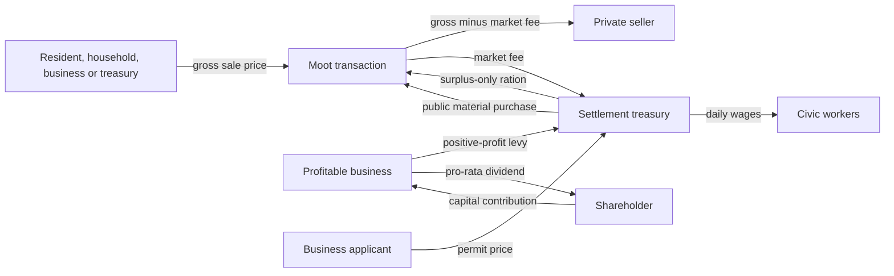

# Civic economy

This document is the authoritative guide to the settlement treasury, enacted policy,
public employment and their interaction with the private market. It describes the live
implementation as of 2026-08-15. Broader economic direction remains in
[WORLD-DESIGN.md](WORLD-DESIGN.md). Company ownership, shares, pooled finance and
vertical integration are specified in [COMPANY-ECONOMY-IMPLEMENTATION.md](COMPANY-ECONOMY-IMPLEMENTATION.md);
business pricing and production are mentioned here only where money crosses the civic boundary.

## The model in one minute

- Residents, households, companies and the settlement treasury are separate owners.
  Productive buildings are operating sites of a company, not extra personal purses.
- The Moot Hall is a physical consignment market. It does not buy all local output and it
  begins with no goods.
- A buyer pays only when a real listed good is purchased. The seller receives the price
  minus the enacted market fee; the fee enters the treasury.
- Private companies pay an enacted levy only on a completed day's positive consolidated
  operating profit after wages, external inputs, delivery and market charges. Internal
  site transfers, losses and shareholder-contributed capital are not taxed.
- Needed housing permits are free. Private business permits cost money. A growth subsidy
  discounts only businesses the settlement has actually requested.
- Public salaries, relief and construction materials spend real treasury coin. Wage and
  tax shortfalls become liabilities instead of disappearing.
- Poor Relief purchases one real market ration for an insolvent resident only when
  sustainable food remains above the enacted reserve floor. In a tactical region the
  resident then queues outside the Moot, visibly collects it and eats in the commons.
- Civic autopilot reviews weekly, requires a Reeve and changes at most one policy lever
  per review. Manual mode leaves all enacted values untouched.
- There is no household tax and no separate food-consumption tax. Food bought at the Moot
  still participates in the ordinary market and therefore its seller pays the general
  market fee.

Coin uses integer pennies. `100` internal units equal `1.00 coin`; percentages use basis
points, where `100` basis points equal `1%`.

## Balanced founding charter

Every newly founded settlement starts with the same politics. The visual settlement seed
chooses streets and centre form, never policy.

| Lever | Balanced value | Enforced range | Live effect |
|---|---:|---:|---|
| Market fee | 5% | 2–10% | Treasury share of every completed Moot sale |
| Positive-profit levy | 10% | 0–15% | Assessed on positive daily operating profit |
| Poor Relief | Surplus Only | Off / Surplus Only | Whether the treasury may buy food for insolvent residents |
| Food reserve target | 3 resident-days | 1–30 | Relief floor and food-capacity planning threshold |
| Civic payroll reserve | 7 funded days | 0–30 | Cash runway protected before another public hire or discretionary purchase |
| Staffing posture | Balanced | Essential / Balanced / Full | Number of tier-bounded civic vacancies advertised |
| Business-permit subsidy | 45% | 0–75% | Discount for settlement-requested private firms only |
| Control | Autopilot | Auto / Manual | Whether the Reeve performs weekly reviews |

The founding cash endowments are currently `10.00 coin` per villager and `20.00 coin` in
the settlement treasury. They bootstrap circulation; they are not recurring income.

## Ownership and physical stock

| Actor | Cash | Physical goods | Durable economic state |
|---|---|---|---|
| Person | `Wallet` | Personal `GoodsInventory` | Employment, home, nutrition and company shares |
| Household | `HouseholdEconomy` | Cabin pantry | Shared necessities purse and household members |
| Company | One authoritative `CompanyAccount` treasury | Goods remain at settlement-local sites/listings | 1,000-share cap table, Company Master, consolidated obligations, profit, capital and dividends |
| Business site | No wallet | Workplace inventory plus seller-owned Moot listings | `BusinessAccount` cost-centre ledger: attributed revenue, expenses, labour, policy, production, liabilities and solvency |
| Settlement | `Settlement::treasury` | Treasury-owned hall stock only | `CivicAccount`, enacted policy and public payroll |
| Moot market | No independent wallet | Hall inventory with seller-aware listings | Offers, completed trades and market quotes |

A good stored at the Moot is not automatically public property. Every listing retains a
`MarketSeller`: a `BusinessId`, `PersonId` or the settlement treasury. The physical hall
inventory and offer book are reconciled so the market cannot sell phantom stock.

Moot Stewards are the early physical logistics workers. A solvent Hamlet can employ up to
two. Each resident in that role collects saleable output from businesses, operates a goods
cart, audits local roads and can build or adopt missing connectors. Producers therefore
keep farming, fishing or chopping instead of spending their shifts carrying every batch to
the hall.

Companies may instead build a private Storage Hall. It adds 2,400 local bulk and up to four
Company Porter jobs. Those workers move only their employer's stock inside the same settlement;
they do not maintain public roads and their trips pay no municipal delivery fee. A company still
has one global treasury, but each settlement keeps independent physical goods, storage capacity
and retain/sell rules. Cross-town movement waits for the later physical caravan system.
An NPC only founds a depot for a company that already controls at least two other local sites,
and it will not autonomously duplicate one in the same branch. Players remain free to buy the
tier-unlocked permit as a speculative infrastructure investment.

## Money flows



All arrows move existing coin. Neither the market nor policy review creates money.

### Private sale

1. A business produces a physical good into its workplace inventory.
2. Its company's local branch protects an absolute retain amount and decides whether excess may be sold; the rule is applied once across all of that company's sites in the settlement.
3. An available Moot Steward or local Company Porter moves a bounded load to the hall and creates a listing owned by that business. Private porters work only for their own company.
4. A real buyer purchases the cheapest acceptable listed units.
5. The buyer loses the gross price. The operating company treasury receives gross minus the market fee. The
   treasury receives the fee.
6. The business records units sold, gross revenue and the fee as an operating expense.

The market also records the part of a once-per-day request which did not clear. `Unavailable`
means there was no eligible physical listing; `unaffordable` means stock existed but the
buyer's cash or maximum bid rejected it. Successful, unavailable and unaffordable demand are
separate daily history series. Substitute foods do not each claim the same wholly empty pantry
request: a household records product-specific rejection only for a good actually offered to it,
while settlement food pressure records a market with no food at all.

Delivery does not trigger payment. Unsold consignments remain the seller's goods, which
prevents the hall from becoming an infinite public buyer.

### Positive-profit levy

At the next day boundary, each company's completed day is consolidated and assessed as:

```text
pre-tax profit = max(0, external revenue - wages - external inputs
                        - market fees - delivery fees)
levy due       = ceil(pre-tax profit × enacted levy rate)
```

Equal internal supply credits and charges are memoranda for site-level diagnosis and cancel
before this calculation. The levy becomes a real `tax_arrears` claim. Payment may use
company cash only after wage arrears are protected. Unpaid tax remains on the company/sites;
contributed capital and a loss-making day never form part of the tax base. Dividends happen
only from retained, withdrawable company profit after liabilities and protected working cash.

Protected working cash is a visible calculation, not a flat magic balance:

```text
protected capital = staffed payroll × strategy reserve days
                  + configured input target × current local input price
                  + 2.00 coin operating buffer
drawable profit  = min(retained profit,
                       cash - wage arrears - tax arrears - protected capital)
```

The five owner strategies vary their payroll horizon, but never protect fewer than two
days. Owner-contributed capital is not profit. Automatic owners therefore cannot empty a
firm one evening and cause its next payroll or input order to fail the following morning.

### Business lifecycle and liquidation

Productive firms follow `New → Operating → Cash tight/Distressed → Insolvent →
Liquidating → For sale`. A new firm remains in its probationary state for three reviewed
days. It can hire, buy inputs and produce, but its owner cannot open another firm until it
has left that state. Distressed, insolvent, liquidating and for-sale holdings also block
portfolio expansion. A viable established firm may still fund a later holding.

Five unpaid-liability days start bankruptcy liquidation. Production and hiring stop;
workers return to the labour market, while their claims remain attached by stable
`PersonId`. The Moot Steward collects **every** good in the failed workplace—including
processor inputs such as Flour, not merely its normal output—and consigns it under the
firm's stable `BuildingId`. Existing and new offers fall by 15% per day to a 25%-of-base
floor. No treasury purchase or invented liquidity is involved.

Liquidation receipts enter the company treasury and settle wage claims first, then ordinary
tax collection. After the workplace, porter and order book are empty for two reviews, the
physical building becomes a separately priced takeover listing. Remaining company money
can leave only through explicit shareholder distributions; there is no hidden site balance.
Unfunded wages and taxes are recorded as separate cumulative defaults rather than silently
erased. A buyer recapitalises the same stable business and history; stock liquidation and
property sale are distinct.

A default is accounting, not a payment. Writing off an unpayable wage reduces the wage
liability and increases cumulative wage defaults, but it does **not** reduce company cash.
Company cash falls only when a living worker, supplier, tax authority or shareholder actually receives
the corresponding money. This distinction is covered by both a focused ledger test and the
Village Lab's per-update conservation audit.

An owner death creates the takeover listing immediately, but also starts this same
liquidation path. A solvent resident may buy and continue the firm before its stock is
cleared. Every new listing remains on the settlement's public property board for one complete
world day before automatic resident investors may acquire it; this keeps succession visible
and prevents a death and takeover collapsing into an unreadable single server tick. If nobody
can buy, staff claims are preserved, production stops and the goods enter
the market instead of remaining forever inside an ownerless property.
If a person dies in the brief interval after selling a consignment but before the queued
payment settles, that payment becomes an unclaimed estate receipt for the local treasury;
the buyer's coin can never disappear into a permanently missing `PersonId`. Unsold Moot
listings owned by that person transfer to the same treasury estate immediately, preventing
later buyers from creating a second missing-recipient race.
As a final conservation guard, settlement processing resolves any sale event whose seller
identity is already absent—person, firm or retired treasury—as an unclaimed-estate receipt
for the market's local treasury instead of leaving the credit in an infinite retry queue.
Only a missing market authority retries, because there is then no safe settlement account.
Queued purchase gross is an explicit temporary clearing balance in the lab: it counts toward
money conservation while in flight, and the final result requires the clearing queue to be
empty.

### Permits and growth subsidy

Needed houses are free for residents. Civic progression buildings are currently public
projects. Private Farmstead, Fisherman's Hut, Windmill, Bakery, Lumberjack Hut and Storage Hall permits
have a positive base price that rises by 50% for each building the applicant already owns.

The Moot does not choose a mandatory next business. Every permit review publishes a ranked
opportunity board derived from current beds, reserve days, recent production, physical and
listed stocks, sales, processing capacity and outstanding construction Wood. A signal of 60
or more is the settlement's current incentive and receives the enacted subsidy. Every other
legal business remains available at full price. An impossible or declined opportunity is
briefly deferred, allowing another household or investor to act instead of freezing growth.
Once the bounded shoreline survey proves that the current terrain has no viable coast,
fishing disappears from that hall's board entirely; a terrain-version change reopens it.

Prospective owners apply their persistent automatic strategy to estimated revenue, input
cost, wages, market fee, local yield quality, existing holdings and deterministic personal
judgement. This is intentionally an estimate rather than perfect foresight. A marginal firm
can open, lose money as prices or labour change, adjust its policy, and eventually close;
successful owners can reinvest in another holding. An owner cannot apply while any existing
firm is unfinished, new, distressed, insolvent, liquidating or for sale. Player-owned businesses can later expose
the same strategy seam as manual controls or autopilot.

For a settlement-requested private business:

```text
price = base × ownership multiplier × (1 - enacted subsidy)
```

The result never falls below `1.00 coin`. A speculative business receives no subsidy. The
discount is foregone permit revenue, not a treasury payment and not newly minted coin.
For an autonomous resident, the permit fee moves from the applicant's wallet into the treasury
when the resident and Hall approve a legal plot. Approval reserves that plot immediately. An observed applicant then joins the shared
FIFO line in the Moot forecourt and only begins sourcing construction Wood after collecting
the stamped permit. This visible administration is compressed away in strategic regions;
it never changes the fee, ownership or material requirement.

An embodied player uses the same market without pretending that the Hall chooses their
plot. Within 12 metres of the Hall, **Permits & Property** first lets the hero found and
capitalise a company, receiving all 1,000 shares and the Company Master office. It then requests
an authoritative quote for the explicitly selected `ACTING AS` company. A newly created hero begins with 20 coin, granted once when its body is created;
re-adopting the live body after a disconnect preserves its current wallet. The first residential
claim in a settlement is free; private business quotes include the company-specific permit fee
and an advisory processor cash recommendation described below. Up to eight unused permits may
be held. The company pays only the actual fee; all other treasury cash remains freely usable.
The owned-permit tray can resume placement at any time or surrender the unused permit for an
exact fee refund to its purchasing company.

Player placement is responsive but not trusted. The client draws the real model footprint,
both future wheat fields, doorway, proposed access lane and 320-metre charter boundary, and
magnetically aligns a building's authored door with the completed road component that actually
reaches the Hall. Holding Shift allows a legal off-road expansion; the road system then builds
the reserved connector. `R` rotates an off-road plot or flips road side, `Tab` cycles nearby
frontages, left click submits, and `Esc` returns the unused permit to its tray. Farmstead and
Lumberjack Hut placement also show the live farmland or timber-quality percentage and band;
low-quality legal land remains the player's economic choice. The server repeats the terrain, earthwork, water, prop, overlap,
field, forest/shore viability and full-width access proof before consuming the permit. Several
players confirming in one simulation tick are checked against earlier accepted plots and lanes
from that same tick. A rejection preserves the permit and escrow.

Once accepted, the permit fee enters the treasury. The exact CompanyId remains on the permit,
worksite and completed firm, while recommended working capital remains ordinary company cash.
Construction Wood remains physical and separate. The owning company pays when the assigned local builder purchases market Wood (the
carrier is never charged for someone else's site), or the builder gathers timber when stock or
owner cash is unavailable. The worksite then follows the ordinary construction, road and
business-initialisation pipeline rather than a player-only shortcut.

One Windmill and one Bakery may be speculative once their upstream physical trade exists.
Additional processors are advertised only when the existing stage used at least 60% of its
two-day input capacity, sold at least 30% of capacity-equivalent output, made a positive
recent profit, and real upstream flow still exceeds installed capacity. Stockpiles are
amortised over seven days; they are not treated as newly produced input on every permit
review. Rated capacity and profit previews come from the physical recipe, ordinary shift
and job-slot count, so changing a recipe or future building-level work rate cannot leave
investment expectations on an unrelated hand-tuned number. This permits mistakes and
changing markets without allowing rows of empty ovens.

There is a second, independent **competitive-entry** route. For two observed days, the output
must have real demand; the incumbent stage must have sold goods and made positive profit; its
recent asking price must remain at least 50% above the sustainable local input, founding-wage,
fee and Balanced-margin estimate; and buyers must either be rejected or find less than half the
target stock listed. Real upstream input must exist. This route does not require the monopolist
to use 60% of nominal capacity: an overpriced incumbent cannot prevent competition merely by
operating slowly. Only one challenger may be approved at once, a newly opened challenger gets
its three-day probation before another review, and an owner who already owns that processor kind
is ineligible for the competitive permit. The competition score begins at 68, above the Hall's
60-point incentive threshold, so this route is explicitly advertised as a subsidized permit.

A processor permit decision recommends enough company cash for at least one complete recipe batch
plus its one-position opening payroll. An unquoted input is budgeted at 2.6x base value so an empty
young firm can survive the first real offer; that is an entry estimate, never a price cap or a
separate escrow. The cash remains in the single company treasury. The Hall does
not set the entrant's price. The owner observes the current and preceding day's local quote and
chooses an opening position through their private strategy: Growth seeks volume below the market,
Balanced and Cautious broadly match it, High Margin asks more, and Opportunistic owners charge
more during scarcity but discount a well-supplied market. The physical recipe, wages, market fee
and that owner's margin provide a solvency floor. If several independent owners keep prices high
and demand remains unfilled after the probation window, another competitive permit can become
attractive. Thereafter each firm's ordinary daily pricing rules apply independently.
Autopilot input bids are also derived from the current output ask, physical recipe, wage offer,
market fee and target margin; the old fixed 175%-of-base input ceiling no longer strands a viable
processor when downstream prices change.

### Public construction

Public projects do not silently take privately consigned Wood. When a project needs market
materials, its available budget is:

```text
discretionary treasury
    = treasury
    - existing civic wage arrears
    - current daily civic payroll × payroll-reserve days
```

The treasury buys real Wood through the same Moot listings, the private seller is paid,
and the civic ledger records a material expense. No purchase occurs when the protected
budget or physical offer is insufficient.

### Civic payroll and arrears

Every current civic role earns `1.00 coin` per completed world day. Wages accrue whether
or not the treasury can immediately pay them. Available treasury cash settles claims in a
deterministic, daily rotated order so one stable identity cannot always capture the last
coin. A person leaving public employment keeps an inactive payroll entry until their debt
is paid.

Private-company payroll follows the same completed-shift convention: at dawn the company
treasury pays each workplace roster and the expense is attributed to the world day which
just ended. Consequently an open `TODAY` ledger can show zero wages before its shift closes;
`PREVIOUS DAY` must preserve the posted expense. Site history and consolidated company
history use that same day boundary.

A proposed hire is allowed only when the treasury can cover all existing arrears plus the
projected full roster for the enacted number of payroll-reserve days:

```text
treasury >= existing arrears + projected daily payroll × reserve days
```

The reserve is a hiring and discretionary-spending constraint, not a separate wallet.
Actual payroll can still exhaust the treasury after conditions worsen, at which point
arrears honestly accumulate.

### Poor Relief

Solvent households and unhoused residents shop first. `Surplus Only` then considers the
residents who could not afford a ration. For each candidate, all of these must remain true:

- recent food production covers the current resident count;
- a physical ready-to-eat Bread or Fish listing exists at the Moot (raw Wheat and
  household-only Flour are never relief rations);
- the treasury can pay its actual listed price;
- after the purchase, hall food remains at or above
  `residents × food-reserve-target-days`.

The treasury purchases the ration through the ordinary market, so the seller is paid and
the market fee still applies. At that moment one listed unit is removed from hall stock and
reserved to the named recipient; it cannot be sold twice while they walk. In an observed
tactical region the recipient takes a stable FIFO place outside the Moot, receives the
ration as visible carried cargo, walks to a small commons spot and eats it. Nutrition is
recorded only at that final collection/eating boundary. A failed last-metre route resolves
the already-paid ration rather than destroying it or wedging the recipient forever.
Strategic regions settle the identical purchase and meal directly without creating an NPC
route. Relief stops as soon as any constraint fails. `Off` means an insolvent resident
misses the meal and becomes hungry.

### Moot service line

Permits, tactical household shopping, personal food purchases and Poor Relief share one
server-owned FIFO queue per Moot Hall. Every ticket has a stable serial and its own authored
forecourt position, so residents no longer target and overlap at one door coordinate. Only
the head is served; the remaining places advance when it leaves. The queue uses ordinary
cached village navigation and master world-time scaling. Repeated terminal route failures
have a bounded counter fallback so one bad prop cannot halt construction or nutrition.
Walking toward the counter resets that fallback, so distance is never mistaken for a stuck
route. Food purchases and relief handovers take one world second at the counter, immigration
registration takes two, and a stamped permit takes three. A regression moves 100 household
shoppers through the physical wave queue in under five world minutes at both 1x and 10x;
daily restocking must not survive into the next morning.

The hall planning clearance is 16 metres. This reserves a real civic forecourt and commons
for the line without adding character-to-character collision or per-frame crowd simulation.
Villagers without an active hall service still use the cheap ambient system, and off-screen
services remain aggregate.

The food reserve target informs the permit-market food signal. Low reserve days and weak
recent production raise both farming and fishing opportunities, but neither is a civic
order. Existing farms, fishers and already-approved sites reduce the next signal. A raw
Wheat backlog suppresses another Farmstead and raises Windmill investment; Flour flow and
Bread scarcity similarly attract Bakeries. Fishing competes directly with farming and can
repeat wherever another complete shoreline plot exists. Site ranking excludes the old failure mode
where high-quality soil across a river filled the shortlist ahead of reachable land. The
target does not multiply a field's production or change daily consumption.

Farmstead output is raw Wheat and does not enter the edible reserve until a staffed
Windmill has purchased and milled it. One Wheat becomes one Flour. Housed households may
use Flour as an abstracted home-baked ration; people without a cabin cannot. A staffed
Bakery purchases two Flour and produces four Bread, adding two net rations and creating the
first higher-efficiency food. Both businesses remain legal at Hamlet tier. Neither is
guaranteed at a population threshold: owners can build ahead speculatively, but actual
upstream stock and profitable throughput make investment much more likely.

## Civic staffing

The Reeve is the administrative position. Worker and guard slots then depend on tier and
staffing posture:

| Tier | Available public workers | Available guards |
|---|---:|---:|
| Hamlet | 2 | 0 |
| Village | 2 | 2 |
| Town | 2 | 2 |
| City | 2 | 2 |

| Posture | Worker target | Guard target |
|---|---:|---:|
| Essential | First worker only | 0 |
| Balanced | All tier worker slots | Up to 1 |
| Full | All tier worker slots | All tier guard slots |

Both founding worker slots are combined Moot Stewards. Each is independently available for
goods collection and road repair, and the collection reservation ledger prevents them from
claiming the same stock or processor order. Guards are already real exclusive jobs and
receive wages, although patrol and combat behaviour remain future work. No resident can
simultaneously hold a civic and private production job. Reducing posture releases an excess
steward only after their current delivery or road job finishes; it does not erase cargo,
unfinished work or wage arrears already earned.

Balanced/Full autopilot fills the second slot when the settlement reaches 24 residents or
saleable workplace stock reaches twenty full cartloads. A surge-hired steward remains until
the backlog falls below six cartloads, avoiding hire/fire oscillation. The payroll-reserve
test still applies, so capacity is available at Hamlet tier without forcing a poor or tiny
foundation to carry three civic salaries.

An advertised position still needs an eligible resident and the hiring reserve. A posture
is therefore a target, not a promise that every slot is instantly filled.

## Civic strategies and autopilot

`CivicStrategy` supplies the values that a healthy automatic settlement tends toward:

| Strategy | Market fee | Profit levy | Relief | Staffing | Permit subsidy |
|---|---:|---:|---|---|---:|
| Balanced | 5% | 10% | Surplus Only | Balanced | 45% |
| Frugal | 3% | 5% | Off | Essential | 20% |
| Mercantile | 4% | 7.5% | Surplus Only | Balanced | 35% |
| Mutual Aid | 6% | 12.5% | Surplus Only | Full | 40% |
| Growth | 4% | 7.5% | Surplus Only | Full | 65% |

Food-reserve and payroll-reserve days are enacted values but are not currently adjusted by
strategy autopilot. They begin at three and seven days respectively and stay there until a
future player/political control changes them through the same policy component.

### Review cadence

The first observation opens a review window. Thereafter a review requires:

- civic autopilot enabled;
- a filled Reeve position; and
- at least seven world days since the last review.

Only one lever can change per review. This inertia is intentional: at 100x the settlement
must behave like the same simulation observed faster, not bounce between tax regimes every
rendered second.

### Treasury stress

A review treats the settlement as stressed when any of these are true:

- civic wage arrears exist;
- treasury cash is below three days of the current payroll; or
- review-window spending is more than twice income, with a `1.00 coin` minimum comparison.

It then attempts exactly the first possible response in this order:

1. Raise the positive-profit levy by 2.5 percentage points, up to 15%.
2. Raise the market fee by 1 percentage point, up to 10%.
3. Reduce the business-permit subsidy by 10 percentage points, down to 0%.
4. Reduce staffing one posture toward Essential.
5. Disable Poor Relief, except under Mutual Aid strategy.

### Healthy finances

When not stressed, the review attempts the first applicable response:

1. Move relief toward the strategy target. Enabling it additionally requires unmet food
   need, sustainable food, the reserve floor and protected payroll cash.
2. Move staffing one step toward the strategy target.
3. Move permit subsidy by 10 percentage points toward the strategy target.
4. If treasury exceeds fourteen current payroll days and review income exceeds spending,
   lower the profit levy by 2.5 points toward target, then lower the market fee by 1 point
   toward target on a later review.

Every enacted adjustment stores its day, reason and label. Setting `autopilot = false`
freezes policy review; simulation systems continue enforcing the manually enacted values.
This is the same control seam used by business management rather than a separate player
economy.

## Relationship to prosperity and tier advancement

Civic policy affects prosperity indirectly through real outcomes: food reserves,
production, housing, employment and hunger. Paying relief can prevent hunger but spends
treasury coin; requesting more food capacity can create businesses and jobs but requires
owners, permits, materials and suitable plots.

Policy does not directly grant prosperity or advance a tier. Hamlet → Village → Town →
City progression still uses the live population, sustained food/prosperity, trade and
civic-building requirements documented in [WORLD-DESIGN.md](WORLD-DESIGN.md) and
[ROADMAP.md](ROADMAP.md). A settlement may continue housing residents below the next tier;
tier is development state, not a hard population cap.

## Inspection and history

Clicking a Moot Hall exposes:

- treasury and common physical store;
- filled and targeted public jobs;
- strategy and auto/manual status;
- market fee and positive-profit levy;
- relief mode, food target, payroll target, staffing and permit subsidy;
- the highest permit-market signals, explicitly labelled as discounted or full-price;
- wage arrears and settlement progression.

The Hall's **Permits & Property** action opens a dedicated, scrollable land ledger. Its permit
column lists every tier-unlocked private permit, with demand band, indicative first-owner price,
enacted discount, Wood requirement and housing/job capacity. A nearby hero can request the exact
fee and processor cash recommendation, purchase it for the visible acting company, and immediately choose a plot. Hamlet uses are
open regardless of demand or upstream supply; Marketplace and Tavern unlock at Village, while
Church unlocks at Town. Those amenities may still be commissioned as public progression works,
but a player may pay a real permit fee to own one. Its property column is driven by the compact
replicated `SettlementPropertyBoard`, so completed businesses and inherited unfinished worksites
remain visible even beyond detailed building replication. Listings show asking price, reason,
listing age and whether they are still inside the one-day public exposure window or open to
automatic investors. Company formation, quotes, paid fees and placement are authoritative server transactions; the
client ghost is deliberately only a prediction of the shared plot rules.

The encyclopedia repeats the enacted charter. The pull-based settlement history stores up
to 365 days and includes separate permit, market-fee, profit-levy and public-sale income;
wage, relief and material spending; staffing; every enacted rate; and the latest policy
adjustment/reason. Business history separately records site P&L, contextual company cash, liabilities, prices,
wages, stock, internal/external flow, capital expenditure, asset book value,
management choices and solvency.

The encyclopedia's **Companies** tab is separate from the civic ledger. It is a
global company directory and personal share portfolio, with filters for all
firms, the Hero's holdings and public share offers. Its company sheet separates
Hero-wallet money, the single company treasury and estimated pro-rata book interest;
lists the exact cap table, Company Master and sites; and exposes current and
previous consolidated P&L. **Full Ledger** requests the selected stable
`CompanyId` only when opened and consolidates all of its site archives across
settlement boundaries. Internal supply credits and charges remain visible as an
audit memo but cancel from company profit. Wages shown on a completed day are the
expense of that day's finished shifts, whether fully paid or retained as arrears.

Expanding a private workplace in the Places encyclopedia shows its current operating
record: lifecycle state, owner strategy, company treasury, site-attributed protected working capital and drawable profit,
wage/tax arrears, latest and lifetime results, sale
policy, wage offer, procurement rules, local levy, staff, stock and relevant extractive
site quality. Windmills and Bakeries omit land quality because it does not alter their
processing output. A
business-only **Business History** action opens that building's stable-`BuildingId` archive;
**Settlement History** remains a separate action. Houses and civic buildings never show a
dead business-history button. Long detail sheets, history charts/tables, trade tables and
the compact world card all use the same pointer-wheel nested scrolling behavior.

The workplace's **Company** action opens the legal firm above that site. It shows
the Company Master, exact 1,000-share cap table, every operated site, one company treasury
and liabilities, contributed capital, asset book value, consolidated P&L,
dividends and bounded executive decisions. Only the appointed Master may change
ordinary operating policy. A holder with more than 500 shares may appoint the
Master. Any shareholder may post one bounded whole-share offer; a buyer pays the
selling shareholder atomically, and neither company cash nor issued-share count
changes. Player Masters purchasing a new business permit automatically use
company retained cash only when the complete project remains affordable after
wage/tax liabilities and the configured payroll runway. Otherwise personal
payment becomes an explicit capital contribution. Company site cards provide separate
**View Details** and **Manage Site** actions. Place drill-down and site management both
provide **Back to Company**, and changing repeated management controls preserves the
current scroll position instead of jumping to the top.

The site-management goods-flow section uses two stock bars and stepped
0/1/2/3/5/7-day controls rather than exposing raw `reorder below` and `target units`
settings. Input cover is derived from the site's real recipe and staffed capacity.
`Company first`, `Best value` and `Company only` explain sourcing without accounting
jargon. Downstream company requests reserve physical goods before public collection;
the supplier's optional output-reserve days are then protected and only the remainder
is market-ready. A manual coverage change pauses owner autopilot so it cannot silently
replace the player's choice.

The Village Lab prints the final charter and its civic ledger. Use:

```bash
cargo village-lab
./run.sh testworld
```

See [VILLAGE-LAB.md](VILLAGE-LAB.md) for the deterministic scenarios and log-reading
guide. The release-only `cargo village-scale-lab` fixture exercises 5,000 residents in 30
settlements and must remain green as policy decisions grow more sophisticated.

## Code ownership

| Concern | Authoritative location |
|---|---|
| Replicated policy, strategy and staffing types | `shared/src/components/actors.rs` |
| Money units, accounts, market, permit and planning formulas | `shared/src/economy.rs` |
| Company identity, 1,000-share cap table and share offers | `shared/src/components/identity.rs` |
| Company migration, pooled finance, dividends and executive review | `server/src/world/village/companies.rs` |
| Direct same-company tactical supply | `server/src/world/village/commerce.rs` |
| Direct same-company strategic supply | `server/src/world/village/strategic.rs` |
| Civic payroll, levy, protected budget and policy review | `server/src/world/village/civic.rs` |
| Permit selection and fee collection | `server/src/world/village/planning.rs` |
| Meals, relief, reserves and prosperity | `server/src/world/village/settlement_economy.rs` |
| Public hiring and Moot Steward duties | `server/src/world/village_roads/steward.rs` |
| Public construction procurement | `server/src/world/village/construction.rs` |
| Private sale settlement and market-fee transfer | `server/src/world/village/businesses/transactions.rs` |
| Bounded civic/business archives | `server/src/world/village/history.rs` |
| Company/site management and share market | `client/src/ui/business_management.rs` |
| Hall and history presentation | `client/src/ui/settlement_panel.rs`, `client/src/ui/history.rs` |

All live and headless-lab systems are registered through
`server/src/world/village/schedule.rs`. Do not create a parallel lab economy or apply time
warp independently inside a civic rule.

## Extension rules

When adding a tax, benefit, public job or civic purchase:

1. Decide which durable owner loses cash and which owner receives it.
2. Move physical goods separately from coin and preserve the seller claim.
3. Record both sides in the appropriate account before exposing the feature in UI.
4. Define whether arrears survive insufficient cash; never silently discard an obligation.
5. Protect stable `PersonId`, `SettlementId` and `BuildingId` joins. Names are display only.
6. Add the rule to the shared live/lab schedule and use `SimulationDelta` for time.
7. Add a focused conservation test, a policy-decision test and relevant history fields.
8. Keep off-screen decisions aggregate. Do not introduce per-tick, world-wide person scans.
9. Update this document, WORLD-DESIGN and ROADMAP in the same change.

The key invariant is simple: policy may redirect incentives and existing resources, but it
must never invent goods, erase liabilities or create money to rescue a tuning problem.

## Intentionally deferred

- Player-facing controls for editing civic policy. The replicated manual-control seam and
  server enforcement exist; the final governance UI and authority checks do not.
- Elections, ideology, factions, councillors and political legitimacy.
- Household income/property taxes, tariffs and inter-settlement fiscal transfers.
- Debt issuance, banks, credit and treasury borrowing.
- Guard patrols, crime, courts and military budgets.
- Processed-food policy, imports, caravans and cross-settlement price arbitration.
- Player-authored wills, inheritance of company shares and estate share auctions. The first automatic
  succession path is live: a dead resident's cash and carried goods enter their
  household (then the hall if unclaimed), owned productive firms become takeover
  listings, and a buyer's payment becomes company working capital rather than
  disappearing into a dead seller account.

These should extend the ownership and ledger model above rather than bypassing it.
